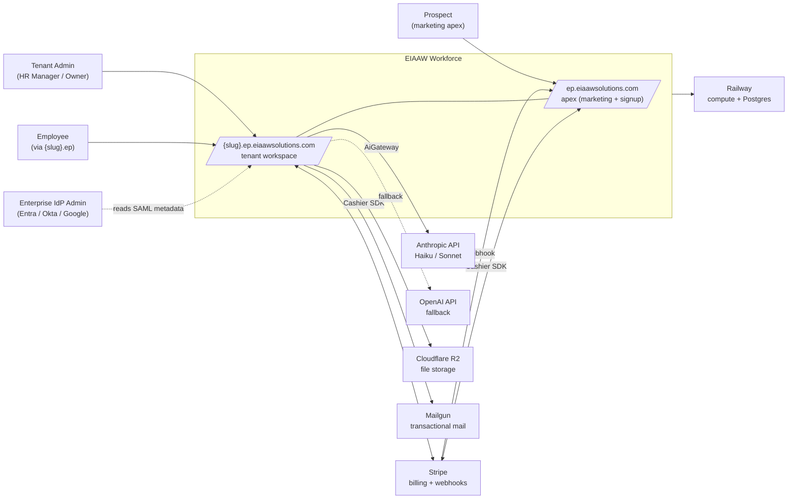
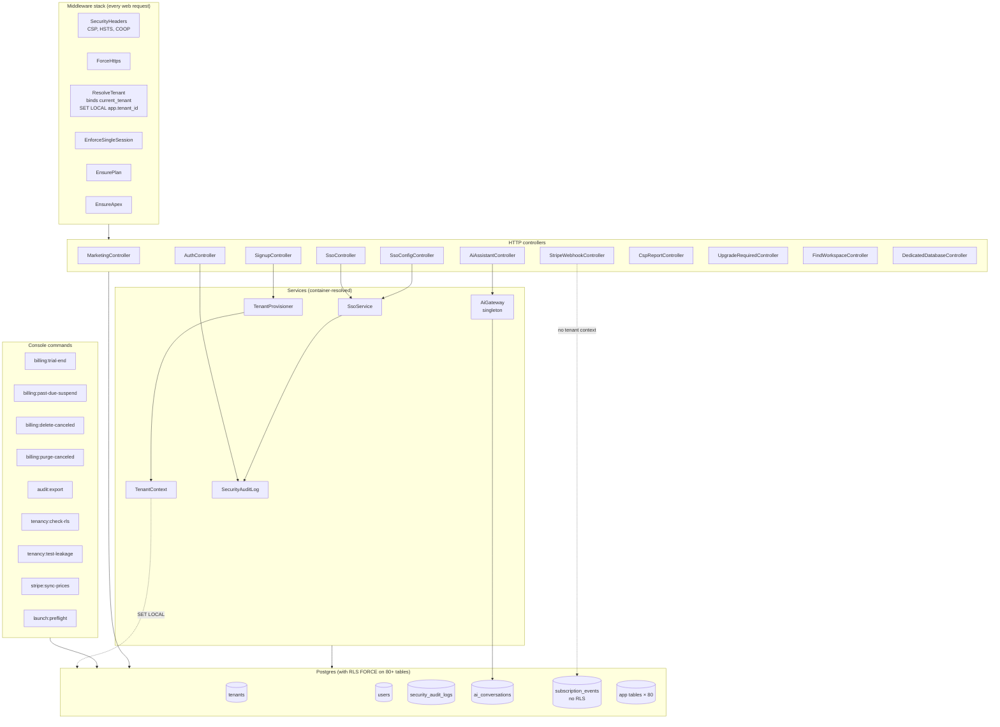
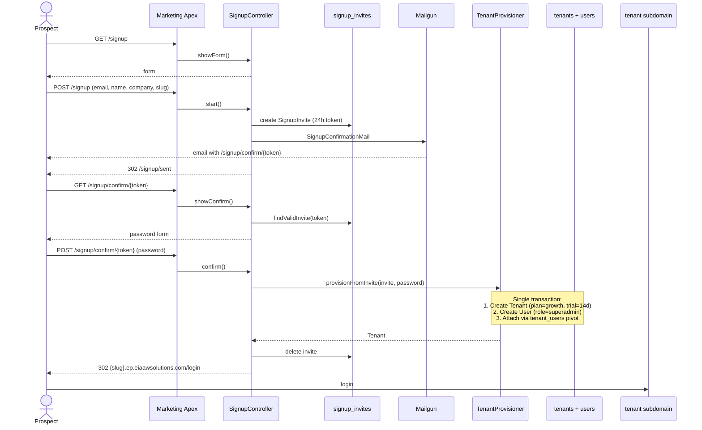
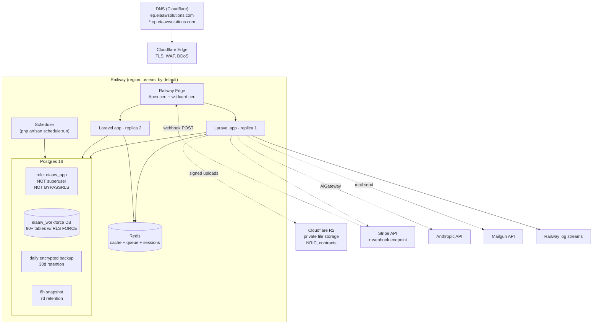
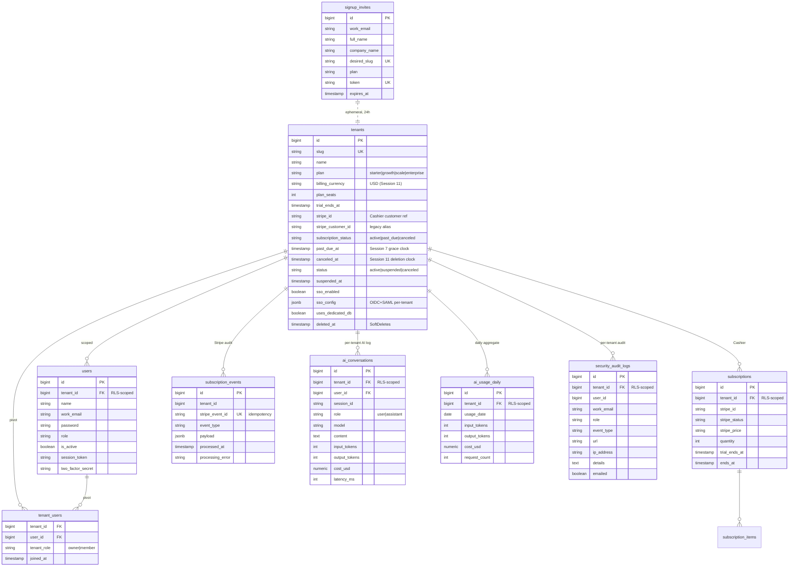

# EIAAW Workforce — Architecture Diagrams

Five Mermaid diagrams covering the shipped system at Session 11 close.
Rendered in GitHub, GitLab, and most modern markdown viewers.

---

## 1. System context

Shows EIAAW Workforce sitting between its users (tenant admins, employees,
IdP admins) and its external dependencies (Stripe, Anthropic, Cloudflare
R2, Railway). Tenant-admin and employee flow through different host
surfaces; the IdP admin flow is the one that consumes the public SAML
metadata endpoint during SSO configuration.

---

## 2. Component diagram

Internal components of the Laravel monolith as of Session 11. Shows the
middleware stack, the tenant-isolation plumbing, and the service boundary
between the AI gateway + Stripe billing + SSO + audit export. The blue
boxes are the per-request middleware chain; the green boxes are services
resolved via the container.

---

## 3. Sequence — signup flow

The three-step tenant signup flow. Illustrates why the flow lives on apex
(not tenant), how `TenantProvisioner` creates the tenant atomically, and
when the redirect crosses from apex to the new tenant subdomain. Stripe
is NOT called during signup (no-credit-card trial) — it's called on day
15 when the trial converts.

---

## 4. Infrastructure diagram

Railway production deployment. Shows the two-host TLS cert (apex +
wildcard), the Postgres-inside-Railway topology, and the out-of-band
services. The `eiaaw_app` DB role is explicitly non-superuser, non-BYPASSRLS
— that's enforced by `tenancy:check-rls` at boot.

---

## 5. ER — core tenant-isolation graph

The tables that matter for tenant isolation + billing + AI. Omits the 80
tenant-scoped domain tables (employees, payroll, etc.) — they all follow
the same pattern: `tenant_id bigint NOT NULL` + Postgres RLS policy using
`eiaaw_current_tenant_id()`.

---

## Maintenance

When you add a new controller / service / command, update the component
diagram. When you add a tenant-scoped table, confirm it's covered by RLS
tests but don't add it to the ER diagram unless it's foundational — 80+
domain tables would make the diagram unreadable.

Re-verify in any session that touches tenant isolation, billing, or auth.
